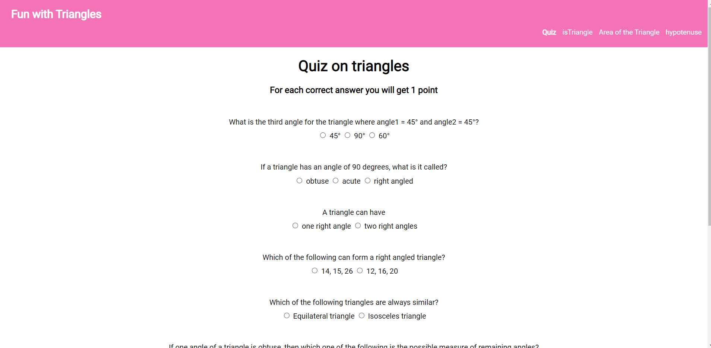
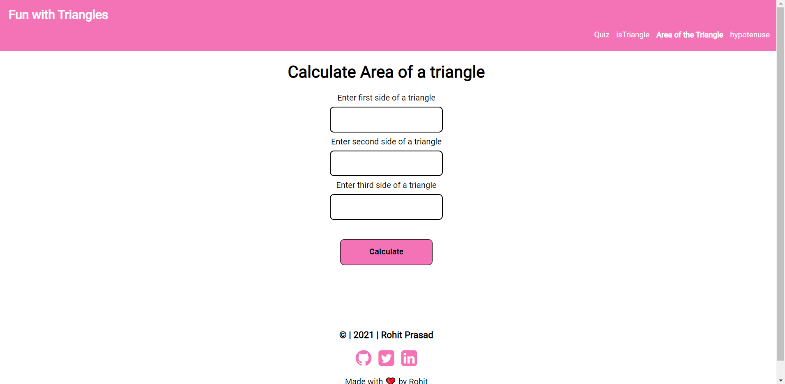
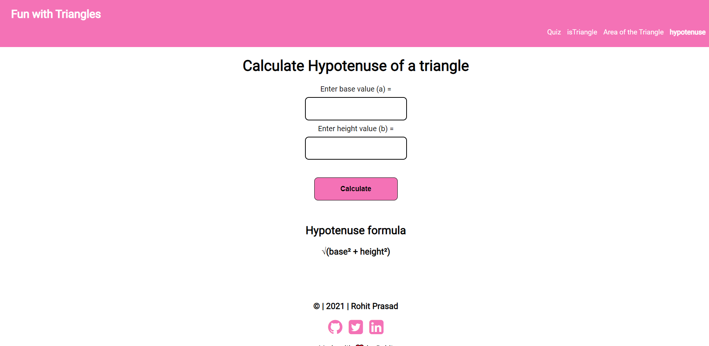

## Fun with Triangles App
This is Fun with Triangles App, having four different parts. They are:
1. A Quiz app which tests your knowledge about triangles
2. Input the angles of a triangle and check whether it is a valid triangle or not.
3. Input the sides of a triangles and get the area of it.
4. Calculate the hypotenuse by entering the base and height of the triangle.

---
## Interface of the app

- **Quiz**

  ---

- **Is Triangle**

---

- **Area of a triangle**

---
- **Calculate the Hypotenuse**

---
## Tech Stack Used:

1. HTML
2. CSS
3. JavaScript

---
## How to use the app:

1. Quiz on Triangles
    - select all the answers of the questions and click on submit answers to check your score.
  
2. Is Triangle.
    - Enter the first Angle value.
    - Enter the second Angle value.
    - Enter the third Angle value.
    - Click on the is Triangle button to check the result.
  
3. Area of the Triangle(in cm).
    - Enter the first side value.
    - Enter the second side value.
    - Enter the third side value.
    - Click on Calculate to get the area of the triangle.
  
4. Calculate Hypotenuse of the triangle.
   - Enter the base of the triangle.
   - Enter the height of the triangle.
   - Click on Calculate to get the Hypotenuse of the triangle. 

---
## Link of the app.

[Fun with Triangles](https://rohit-mark-12-triangles-app.netlify.app/)